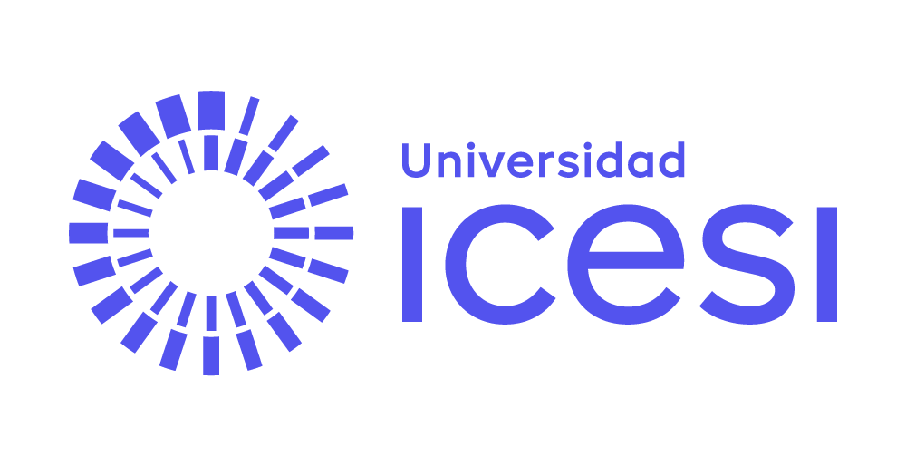

<div style="text-align:center; margin-top:-0.4em; margin-bottom:0.4em;">

</div>

<div id="contact-links" style="text-align:center; font-size:15px; color:#555; margin-bottom:1.4em;">
Maestría en Economía y en Ciencias Administrativas · Econometría I &nbsp;|&nbsp; CIENFI — Universidad Icesi<br/>
<strong>Profesor:</strong> PhD. Eduard F. Martínez-González &nbsp;|&nbsp;
<a href="mailto:efmartinez@icesi.edu.co" style="color:#0055a5;">efmartinez@icesi.edu.co</a> &nbsp;|&nbsp;
<a href="https://eduard-martinez.github.io" style="color:#0055a5;">eduard-martinez.github.io</a>
</div>

## Bienvenida

Este es un curso **breve e intensivo** para llegar a la Maestría con una base común de R: importar, limpiar, transformar, cruzar, describir y visualizar datos, estimar regresiones básicas y —sobre todo— trabajar de forma **ordenada y reproducible**, como se trabaja en la investigación aplicada. No hace falta experiencia previa en programación.

::: {.callout-key}
**La lógica del curso: ver → replicar → aplicar**

Cada unidad se recorre en tres pasos:

1. **Ver** la teoría (los documentos tienen código ejecutable en el navegador: no necesita instalar nada para empezar a probar) y el video de apoyo.
2. **Replicar** la práctica guiada en RStudio, dentro de su propio proyecto.
3. **Aplicar** en la tarea con su cuestionario y en la actividad con IA.

Las sesiones sincrónicas *abren* cada bloque; el grueso del aprendizaje ocurre haciendo.
:::

## Las cuatro unidades

**Unidad 1 — Fundamentos de R y flujo de trabajo reproducible.** Qué hace R cuando ejecutamos código, cómo leer errores y warnings, vectores y data frames, y la base de todo el curso: proyectos de RStudio, carpetas ordenadas y scripts con estilo.

**Unidad 2 — Manejo de datos con tidyverse.** El 80% del trabajo empírico real: importar y diagnosticar, limpiar una base sucia con decisiones documentadas, transformar con `dplyr`, agrupar y cruzar bases con `join`.

**Unidad 3 — Visualización y estadísticas descriptivas.** De la base limpia al hallazgo comunicable con `ggplot2` y tablas descriptivas, trabajando sobre un extracto real de la GEIH (DANE).

**Unidad 4 — Regresiones básicas y flujo de trabajo empírico.** La ecuación de Mincer en la GEIH: `lm`, interpretación con unidades (y sin causalidad injustificada), `fixest`, tablas con `modelsummary` y el pipeline reproducible completo.

### Materiales por unidad

| Unidad | Teoría | Video guía | Práctica | Tarea | Cuestionario | Actividad IA |
|---|---|---|---|---|---|---|
| **1. Fundamentos** | [Ver teoría](unidad-1-fundamentos/teoria/teoria_unidad-1.html) | [Ver video](https://www.youtube.com/watch?v=_UnjI5eTkNc&t=963s) | [Práctica 1](unidad-1-fundamentos/practica/practica_unidad-1.html) | [Tarea 1](unidad-1-fundamentos/tarea/tarea_unidad-1.html) | [Cuestionario 1](unidad-1-fundamentos/tarea/cuestionario_unidad-1.html) | [Primero tú, luego la IA](unidad-1-fundamentos/actividad_ia_unidad-1.html) |
| **2. Manejo de datos** | [Ver teoría](unidad-2-manejo-datos/teoria/teoria_unidad-2.html) | [Ver video](https://www.youtube.com/watch?v=MVNvoBbELKs&t=1801s) | [Práctica 2](unidad-2-manejo-datos/practica/practica_unidad-2.html) | [Tarea 2](unidad-2-manejo-datos/tarea/tarea_unidad-2.html) | [Cuestionario 2](unidad-2-manejo-datos/tarea/cuestionario_unidad-2.html) | [El código corre… pero está mal](unidad-2-manejo-datos/actividad_ia_unidad-2.html) |
| **3. Visualización** | [Ver teoría](unidad-3-visualizacion/teoria/teoria_unidad-3.html) | [Ver video](https://www.youtube.com/watch?v=sCfhUTHA4fQ) | [Práctica 3](unidad-3-visualizacion/practica/practica_unidad-3.html) | [Tarea 3](unidad-3-visualizacion/tarea/tarea_unidad-3.html) | [Cuestionario 3](unidad-3-visualizacion/tarea/cuestionario_unidad-3.html) | [Mejora esta figura](unidad-3-visualizacion/actividad_ia_unidad-3.html) |
| **4. Regresiones** | [Ver teoría](unidad-4-regresiones/teoria/teoria_unidad-4.html) | — (sin video) | [Práctica 4](unidad-4-regresiones/practica/practica_unidad-4.html) | [Tarea 4](unidad-4-regresiones/tarea/tarea_unidad-4.html) | [Cuestionario 4](unidad-4-regresiones/tarea/cuestionario_unidad-4.html) | [Crítica al econometrista artificial](unidad-4-regresiones/actividad_ia_unidad-4.html) |

## Calendario (julio–agosto de 2026)

Sesiones sincrónicas de 10:00 a 12:00.

| Ses. | Fecha | Modalidad | Contenido / hito |
|---|---|---|---|
| 1 | Martes 14 jul | Sincrónica | Unidad 1: R, RStudio y proyectos; arranque de la Unidad 2 |
| — | 14–21 jul | Asincrónica | Teoría y práctica U1 · Tarea 1 · Actividad IA 1 |
| 2 | Martes 21 jul | Sincrónica | Unidad 2: limpieza, dplyr y joins sobre la base de firmas |
| — | 21–27 jul | Asincrónica | Práctica U2 · Tarea 2 · Actividad IA 2 · teoría U3 |
| 3 | Lunes 27 jul | Sincrónica | Unidades 3 y 4: gráficos, descriptivas y regresiones; **lanzamiento del proyecto final** |
| — | 27 jul – 2 ago | Asincrónica | Tareas 3 y 4 · Actividades IA 3 y 4 · proyecto en parejas |
| 4 | Lunes 3 ago | Sincrónica | **Sustentación de proyectos finales** |

## Grabaciones y material de las sesiones

Después de cada sesión sincrónica quedan aquí la **grabación**, las **diapositivas** y el **material que trabajamos en clase**.

Desde la sesión 2 el material no es un script suelto sino el **proyecto completo** que construimos en vivo: descárguelo, descomprímalo, abra el `.Rproj` y corra `pipeline/run_pipeline.R`. Así rehace los pasos con la misma estructura de carpetas y rutas relativas que usamos en clase.

<!-- CÓMO ACTUALIZAR ESTA TABLA (profesor):
     Estructura local: sesiones/sesion_N/ contiene el repo, su .zip y diapositivas/
     · Material: suba a Dropbox la carpeta sesiones/sesion_N/ (o el .zip del repo)
       y pegue el enlace de la carpeta. Si la sesión no tuvo repo, enlace el .R.
     · Diapositivas: enlace sesion_N/diapositivas/sesion_N_diapositivas.pdf
     · Grabación: reemplace "— (pendiente)" por  [Ver grabación](URL_DEL_VIDEO)
     Deje "— (pendiente)" en lo que aún no exista: así el estudiante ve que falta. -->

| Ses. | Fecha | Tema de la sesión | Grabación | Diapositivas | Material de la sesión |
|---|---|---|---|---|---|
| **1** | Martes 14 jul | Unidad 1: R, RStudio y proyectos; arranque de la Unidad 2 | [Ver grabación](https://youtu.be/_g2LXfCSMEQ) | — (sin diapositivas) | [sesion_1.R](https://www.dropbox.com/scl/fi/vwuwan2l8bcwga2titepd/sesion_1.R?rlkey=qcuoexcj4moa10ro56zg6kglj&st=zked1bru&dl=0) |
| **2** | Martes 21 jul | Unidad 2: limpieza, `dplyr` y joins sobre la base de firmas | [Ver grabación](https://youtu.be/ldYulrkGkzc) | — (sin diapositivas) | [Proyecto `repo_sesion_dos`](https://www.dropbox.com/scl/fo/84jupeczzyzub5u69jrzw/ANu7NNPYl8bBukSdMCNwy5A?rlkey=1y404rglc8fpj0waa498pkyoj&st=jhx8npuj&dl=0) |
| **3** | Lunes 27 jul | Unidades 3 y 4: gráficos, descriptivas y regresiones | [Ver grabación](https://youtu.be/F_uYqpY96xs) | — (pendiente) | [Proyecto `repo_sesion_tres`](https://www.dropbox.com/scl/fo/m3ar0l2gl89f13w6w5xdx/AJXqWTvPpt_QDiV3dISHbNg?rlkey=qakewoqt07tc47kwkgwn7nfft&st=w2hhewq0&dl=0) |
| **4** | Lunes 3 ago | Sustentación de proyectos finales | — (pendiente) | — (pendiente) | — (no aplica) |

<!-- PENDIENTE (profesor):
     · Sesión 3, Diapositivas: falta el enlace de Dropbox de
       sesiones/sesion_3/diapositivas/sesion_3_diapositivas.pdf
     Al copiar un vínculo de Dropbox, use el completo; debe verse así:
       https://www.dropbox.com/scl/fo/<id>/<token>?rlkey=<clave>&st=<st>&dl=0
     Si le falta el <token> o el ?rlkey=, el enlace da 404. -->

## Evaluación

| Componente | Peso | Uso de IA permitido |
|---|---|---|
| Tareas 1–4 (script + cuestionario) | 40% | Para entender y depurar, declarado |
| Actividades con IA | 10% | Diseñadas para usar IA con verificación |
| Proyecto final (pipeline reproducible + informe) | 35% | Integrada, con apéndice de uso |
| Sustentación oral (defensa del código) | 15% | **Sin IA** |

::: {.callout-practice}
**La política de IA en una frase**

Primero su cerebro, luego la IA; todo lo que la IA produzca se **verifica**; y todo uso se **declara**. Los niveles permitidos por entrega y la lista de verificación están en la [Guía de uso de IA](ia/guia_uso_ia.html).
:::

## Proyecto final

Un análisis empírico completo en parejas sobre la base de **innovación empresarial**: limpiar con decisiones documentadas, construir indicadores por sector y compararlos con el referente nacional, graficar, estimar la relación innovación–ventas e interpretarla — todo en un proyecto reproducible que se defiende oralmente. [Enunciado](proyecto_final/enunciado_proyecto_final.html) · [Rúbrica](proyecto_final/rubrica_proyecto_final.html).

## Datos del curso

| Base | Grano | Se usa en |
|---|---|---|
| [innovacion_empresas.csv](datos/innovacion_empresas.csv) | Firma (506, *deliberadamente sucia*) | U1, U2 y proyecto final |
| [sectores_agregado.csv](datos/sectores_agregado.csv) | Sector (7, referente limpio) | U2 y proyecto final |
| [geih_nivelacion.csv](datos/geih_nivelacion.csv) | Persona ocupada (21.821, **GEIH real**) | U3 y U4 |

Descripción variable a variable: [diccionario de datos](datos/diccionario_datos.html).

## Guías del curso

- [Programa completo del curso](programa/programa_curso.html) — objetivos, metodología, bibliografía
- [Guía de estilo de scripts](buenas_practicas/guia_estilo_scripts.html) — cómo se escribe un script en este curso
- [Guía de organización de proyectos](buenas_practicas/guia_organizacion_proyecto.html) — carpetas, reglas y la prueba de reproducibilidad
- [Plantilla de proyecto](buenas_practicas/plantilla_proyecto.html) — estructura lista para copiar (descargable)
- [Guía de uso de IA](ia/guia_uso_ia.html) — reglas, niveles, prompts y lista de verificación

## Antes de la primera sesión

Instale [R](https://cran.r-project.org/) y [RStudio Desktop](https://posit.co/download/rstudio-desktop/), y luego los paquetes del curso (en la consola de RStudio):

```r
install.packages(c("tidyverse", "rio", "readxl", "janitor",
                   "skimr", "pacman", "fixest", "modelsummary"))
```

Con eso está listo. Si algo falla en la instalación, escríbame **antes** de la primera sesión: [efmartinez@icesi.edu.co](mailto:efmartinez@icesi.edu.co).
