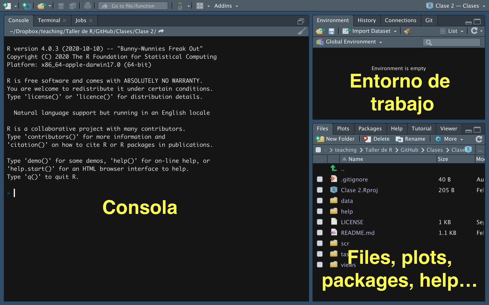

<div id="contact-links" style="text-align:center; font-size:15px; color:#555; margin-top:-0.3em; margin-bottom:1em;">
<a href="../../index.html" style="color:#555; text-decoration:none; margin-right:16px;">Inicio del curso</a>
<a href="https://twitter.com/emartigo" style="color:#555; text-decoration:none; margin-right:16px;">\@emartigo</a>
<a href="https://github.com/eduard-martinez" style="color:#555; text-decoration:none; margin-right:16px;">GitHub: eduard-martinez</a>
<a href="https://eduard-martinez.github.io" style="color:#555; text-decoration:none;">eduard-martinez.github.io</a>
<span id="webr-status-anchor"></span>
</div>

```{webr-r}
#| context: setup

## mini base de la unidad (disponible en toda la pagina)
personas <- data.frame(
  id      = 1:5,
  sexo    = c("mujer", "hombre", "mujer", "hombre", "mujer"),
  edad    = c(28, 45, 35, 52, 23),
  ingreso = c(1500000, 2200000, 1800000, 3500000, 900000)
)
```

<!--=================-->
# Objetivo de la unidad

Este es un curso de **nivelación**, no un curso de programación en abstracto. El objetivo de esta unidad NO es memorizar sintaxis: es entender **qué hace R cuando ejecutamos código**, **cómo leer lo que nos responde** y **cómo organizar el trabajo desde el primer día** para que cualquier análisis sea reproducible.

::: {.callout-key}
**¿Por qué R en una Maestría en Economía?**

Porque el trabajo empírico en economía es, en la práctica, un flujo de datos: importar una base (una encuesta de hogares, un panel de firmas, registros administrativos), limpiarla, construir variables, describirla, estimar un modelo y comunicar resultados. R cubre todo ese flujo con una ventaja clave sobre Excel o el trabajo manual: **cada paso queda escrito en un script que cualquiera puede volver a ejecutar**. Esa propiedad —la reproducibilidad— es hoy un estándar en la investigación aplicada y en el trabajo profesional con datos.
:::

## Lo que aprenderemos en esta unidad

**1. Entender qué hace R cuando ejecutamos código**

- Qué pasa "por dentro" cuando presionamos ejecutar
- Cómo R almacena información (objetos en memoria)
- Por qué algunos comandos funcionan y otros no

**2. Leer e interpretar lo que R nos muestra**

- Diferenciar entre resultados normales, advertencias (warnings) y errores
- Entender la consola como "conversación" con R
- Leer el panel Environment para saber qué existe en cada momento

**3. Reconocer objetos y estructuras de datos**

- Vectores (una dimensión) y data frames (tablas)
- Cómo acceder y manipular información básica

**4. Trabajar de forma ordenada y reproducible**

- Proyectos de RStudio (`.Rproj`) y rutas relativas
- Estructura de carpetas del curso y estilo de scripts

<!--=================-->
# Interfaz de RStudio

R es el lenguaje; RStudio es un [IDE]{.term} (Entorno de Desarrollo Integrado) que hace más fácil trabajar con R. Organiza su espacio de trabajo en cuatro paneles, cada uno con una función específica.

{width="700"}

## Los cuatro paneles principales

### Panel superior izquierdo: Source (Editor de scripts)

Este es nuestro "cuaderno de trabajo". Aquí:

- Escribimos código que queremos guardar y reutilizar
- Documentamos nuestro análisis paso a paso
- Ejecutamos líneas con `Ctrl + Enter` (Windows/Linux) o `Cmd + Enter` (Mac)

**¿Por qué escribir aquí y no directamente en la consola?**

Porque necesitamos poder reproducir nuestro trabajo, corregir errores y compartir análisis con otros. El script es nuestra "memoria" del proceso analítico: si dentro de tres meses un coautor (o su yo del futuro) pregunta cómo se construyó una variable, la respuesta debe estar en el script, no en la memoria de nadie.

### Panel inferior izquierdo: Console (Consola)

La consola es donde R "nos habla". Aquí:

- Aparecen los resultados de lo que ejecutamos
- R nos muestra mensajes, advertencias y errores
- Podemos escribir código directamente (pero no se guarda)

::: {.callout-practice}
**Cómo leer la consola**

Cuando ejecutamos código, R puede responder de tres formas:

- **Resultado normal:** muestra el output esperado
- **Warning (advertencia):** algo inesperado, pero el código continúa
- **Error:** algo falló y el código se detiene

Aprenderemos a distinguir estos tres casos más adelante en esta misma unidad.
:::

### Panel superior derecho: Environment / History

**Environment (Entorno):** muestra todos los objetos que hemos creado en la sesión actual (datos, variables, resultados). Es el "inventario" de lo que existe en la memoria de R en este momento.

**History (Historial):** registra todos los comandos que hemos ejecutado durante la sesión.

::: {.callout-key}
**El Environment es su aliado**

Durante todo el curso, el panel [Environment]{.term} será su mejor referencia. Si un objeto no aparece aquí, R no lo "conoce" y dará error si intenta usarlo. Si ejecutó código correctamente, debería ver nuevos objetos aparecer en este panel.
:::

### Panel inferior derecho: Files / Plots / Packages / Help

**Files:** navegador de archivos del proyecto (carpetas, datos, scripts)
**Plots:** visualización de gráficos que generamos
**Packages:** listado de paquetes (librerías) instalados y cargados
**Help:** documentación de funciones (se abre cuando usamos `?nombre_funcion`)

---

## Flujo de trabajo recomendado

::: {.callout-workflow}
**La rutina de trabajo en RStudio**

1. **Escribo** código en el panel [Source]{.term} (script)
2. **Ejecuto** la línea o bloque seleccionado (`Ctrl/Cmd + Enter`)
3. **Reviso** el resultado en la [Console]{.term} (¿funcionó? ¿error? ¿warning?)
4. **Verifico** el [Environment]{.term} (¿se creó el objeto? ¿tiene los valores esperados?)

Este ciclo se repite constantemente durante el análisis de datos. No es necesario memorizarlo: se volverá automático con la práctica.
:::

## Mini-ejercicio: Reconociendo los paneles

Abra RStudio y localice cada panel. Luego:

1. En la [Console]{.term}, escriba `2 + 2` y presione Enter. ¿Dónde aparece el resultado?

```{webr-r}
2 + 2
```

2. Escriba `?mean` en la consola. ¿En qué panel se abre la ayuda?

Si puede responder estas preguntas, ya entendió la función básica de cada panel.

<!--=================-->
# R como calculadora

Antes de trabajar con datos, podemos usar R como calculadora para familiarizarnos con la [consola]{.term}.

## Operaciones aritméticas básicas

```{webr-r}
# Suma
10 + 5

# Resta
20 - 8

# Multiplicación
4 * 7

# División
100 / 4

# Potencia
2^3

# Módulo (resto de división)
17 %% 5
```

**Nota importante:** estos resultados aparecen en la consola pero **no se guardan** en ningún lugar. Si queremos reutilizar un resultado, necesitaremos aprender a "guardarlo" (lo haremos en la sección de objetos).

## Orden de precedencia

R sigue las reglas matemáticas estándar: paréntesis `( )`, potencias `^`, multiplicación `*` y división `/`, suma `+` y resta `-`.

```{webr-r}
# Sin paréntesis: primero multiplica, luego suma
2 + 3 * 4

# Con paréntesis: primero suma, luego multiplica
(2 + 3) * 4
```

::: {.callout-practice}
**Regla práctica**

Cuando tenga dudas sobre el orden de operaciones, use paréntesis. Es mejor ser explícito que obtener un resultado inesperado. Ejemplo típico en economía: una tasa de crecimiento se calcula `(final - inicial) / inicial`, y los paréntesis del numerador NO son opcionales.
:::

## Operadores de comparación

R puede comparar valores y devolver verdadero o falso:

```{webr-r}
# Mayor que
10 > 5

# Igual a (nota: dos signos igual)
10 == 10

# Diferente de
10 != 5
```

**Nota importante:** para comparar si dos valores son iguales usamos `==` (dos signos igual). Más adelante veremos que `=` (un solo igual) sirve para otra cosa: asignar valores dentro de funciones.

## Operadores lógicos

```{webr-r}
# Y lógico: ambas condiciones deben ser verdaderas
10 > 5 & 10 < 20

# O lógico: al menos una condición debe ser verdadera
10 > 5 | 10 > 20
```

::: {.callout-connect}
**¿Para qué sirven estas comparaciones?**

En la Unidad 2 usaremos estos operadores para filtrar bases de datos. Por ejemplo: "mostrar solo las firmas con ventas > 1000 millones y departamento == 'Valle del Cauca'". Por ahora, solo necesitamos saber que existen y cómo funcionan.
:::

<!--=================-->
# Tipos de datos

En R existen diferentes tipos de datos. Los tres más comunes son: numérico, carácter y lógico.

## Numérico

```{webr-r}
# Números enteros
42

# Números decimales (el separador decimal SIEMPRE es punto)
3.14159
```

## Carácter (texto)

Siempre va entre comillas `" "` o `' '`:

```{webr-r}
# Texto simple
"Cali"

# Nota: "100" es texto, no número
"100"
```

::: {.callout-warning}
**Cuidado con las comillas**

`100` (sin comillas) es un número que puede sumarse, multiplicarse, etc.
`"100"` (con comillas) es texto que R no puede usar en operaciones matemáticas.

Este es un error muy común al importar datos: una columna de ingresos que llega como texto (`"1.200.000"`, `"ND"`, `"$500"`) no se puede promediar hasta convertirla en número. Lo veremos de frente en la Unidad 2.
:::

## Lógico

Solo dos valores posibles: `TRUE` o `FALSE` (en mayúsculas, sin comillas). Resultan de comparaciones:

```{webr-r}
# Esta comparación devuelve TRUE
10 > 5
```

## Valores especiales

```{webr-r}
# NA: dato faltante (Not Available)
NA

# NULL: ausencia de valor (vacío)
NULL

# Inf: infinito (resultado de operaciones como 1/0)
1/0

# NaN: "Not a Number" (operación matemáticamente indefinida)
0/0
```

::: {.callout-practice}
**¿Cuál es la diferencia entre NA y NULL?**

- [NA]{.term} significa "dato faltante": había un espacio para un valor, pero no lo conocemos. Ejemplo: un hogar encuestado no reportó su ingreso.
- [NULL]{.term} significa "inexistente": no hay ni siquiera un espacio.

En datos de encuestas (GEIH, EDIT, censos) los [NA]{.term} son la regla, no la excepción. Buena parte de la Unidad 2 trata sobre qué hacer con ellos.
:::

**Hasta aquí hemos visto:** podemos usar R como calculadora y obtener resultados inmediatos, pero estos resultados **no se guardan**. En la siguiente sección aprenderemos a guardar información para reutilizarla.

<!--=================-->
# Objetos y asignación

## ¿Qué es un objeto?

Un objeto es un **nombre** que almacena **información** en la memoria de R. Es como una etiqueta que le ponemos a algo para poder referirnos a ello después.

**Analogía:** si calculamos `10 + 5`, el resultado `15` aparece en la consola pero desaparece inmediatamente. Si queremos usar ese `15` más tarde, necesitamos "guardarlo" con un nombre. Eso es un objeto.

::: {.callout-key}
**Concepto fundamental: todo es un objeto**

En R absolutamente todo es un objeto: un número, una base de datos, un gráfico, un modelo de regresión estimado. Esta filosofía nos permite tener varias bases abiertas al mismo tiempo, guardar los resultados de distintos modelos y compararlos, sin "guardar y cargar" constantemente como en Excel o Stata.
:::

## Crear objetos: asignación con `<-`

```{webr-r}
# Crear un objeto llamado 'salario_mensual'
salario_mensual <- 1300000

# Ahora podemos usarlo
salario_mensual

# Operaciones con el objeto: salario anual con prima
salario_mensual * 13
```

**Estructura general:**

```r
nombre_objeto <- valor_o_resultado
```

**¿Qué pasó?**

1. R calculó el valor `1300000`
2. Lo guardó en memoria con el nombre `salario_mensual`
3. El objeto aparece en el panel [Environment]{.term}
4. Ahora podemos usar ese nombre en lugar de escribir el número cada vez

## Más ejemplos de asignación

```{webr-r}
# Guardar resultado de operación: ingreso real (deflactado)
ingreso_nominal <- 2000000
inflacion <- 0.09
ingreso_real <- ingreso_nominal / (1 + inflacion)
ingreso_real

# Guardar resultado de función
ingreso_promedio <- mean(c(800000, 1300000, 2500000, 950000))
ingreso_promedio
```

## ¿`<-` o `=`?

Ambos funcionan para asignar, pero la convención de la comunidad R (y de este curso) es:

::: {.callout-practice}
**Recomendación del curso**

Use `<-` para asignar objetos:

```r
resultado <- mean(ingresos)
```

Reserve `=` para argumentos dentro de funciones:

```r
mean(ingresos, na.rm = TRUE)
```

**Atajo de teclado:** `Alt + -` (Windows/Linux) u `Option + -` (Mac) escribe `<-` automáticamente.
:::

## Reglas para nombrar objetos

**Reglas obligatorias:**

- Debe empezar con letra (no con número)
- Puede contener letras, números, `.` y `_`
- NO puede contener espacios ni tildes
- Es sensible a mayúsculas (`ingreso` ≠ `Ingreso`)

```{webr-r}
# Válidos
ingreso_2024 <- 50000
tasa_desempleo <- 0.104

# NO válidos (producen error si quita el #)
# 2024_ingreso <- 50000    # empieza con número
# tasa desempleo <- 0.104  # contiene espacio
```

::: {.callout-practice}
**Buenas prácticas de nomenclatura (estándar del curso)**

Use **snake_case**: minúsculas, sin tildes, palabras separadas con `_`.

```r
# Mal
x <- 1500
VentasTotales2024 <- 2000

# Bien
salario_hora <- 1500
ventas_totales <- 2000
```

Prefiera nombres descriptivos (`tasa_descuento` dice más que `0.15` suelto) y evite nombres de funciones existentes (`mean`, `data`, `df`).
:::

## Mini-ejercicio: Creando objetos

```{webr-r}
# 1. Cree el salario por hora y las horas mensuales
salario_hora <- 6200
horas_mes <- 192

# 2. Calcule el salario mensual
salario_mes <- salario_hora * horas_mes
salario_mes

# 3. Calcule el salario anual (12 meses + 1 prima)
salario_anual <- salario_mes * 13
salario_anual
```

**Revise el panel [Environment]{.term}:** debería ver cuatro objetos creados.

<!--=================-->
# Inspeccionar objetos: clase y estructura

Ahora que sabemos crear objetos, necesitamos herramientas para **inspeccionar** qué contienen. R provee dos funciones "lupa" que usaremos todo el semestre:

```{webr-r}
ingreso <- 1200000
class(ingreso)   # ¿qué tipo de objeto es? -> numeric

ciudad <- "Cali"
class(ciudad)    # character

ocupado <- TRUE
class(ocupado)   # logical
```

`str()` muestra la estructura completa (será especialmente útil con tablas):

```{webr-r}
str(ingreso)
str(ciudad)
```

::: {.callout-key}
**¿Cuándo usar las lupas?**

- Al **importar datos**: ¿la columna de ingresos quedó numérica o llegó como texto?
- Al **recibir un error**: ¿el objeto es del tipo que la función espera?
- Antes de **calcular**: ¿este promedio tiene sentido con este tipo de dato?

En la Unidad 2 estas preguntas serán el primer paso de todo diagnóstico de una base de datos.
:::

<!--=================-->
# ¿Qué puede pasar en la consola?

Cuando ejecutamos código, R nos responde de tres formas. Aprender a interpretarlas es la habilidad más importante de esta unidad.

## Output normal (resultado esperado)

```{webr-r}
mean(c(10, 20, 30))
```

La notación `[1]` indica que estamos viendo el primer elemento del resultado.

## Warning (advertencia)

Un [warning]{.term} NO detiene la ejecución, pero alerta que algo inesperado ocurrió.

```{webr-r}
# Logaritmo de un número negativo
log(-1)
```

**Otro ejemplo, el más común en datos reales:**

```{webr-r}
# Promedio con valores faltantes
ingresos <- c(1200000, 800000, NA, 2500000)
mean(ingresos)
```

El resultado es `NA` porque hay un dato faltante. La solución:

```{webr-r}
mean(ingresos, na.rm = TRUE)  # na.rm = "remover NAs"
```

::: {.callout-practice}
**¿Qué hacer cuando ve un warning?**

1. **Lea el mensaje completo** (no lo ignore automáticamente)
2. **Revise el resultado:** ¿tiene sentido o es `NA`/`NaN`?
3. **Ajuste el código si es necesario** (como agregar `na.rm = TRUE`)

Los warnings son "alertas amarillas": R pudo ejecutar, pero quiere que verifiquemos.
:::

## Error (fallo que detiene la ejecución)

```{webr-r}
# Intentar usar un objeto que no existe
ingreso_promedio_hogar
```

**Mensaje:** `Error: object 'ingreso_promedio_hogar' not found`

**Interpretación:** R buscó ese nombre en el [Environment]{.term} y no lo encontró. Posibles causas: olvidamos crearlo, lo escribimos mal, o lo borramos.

```{webr-r}
# Argumento mal escrito
mean(x = c(1, 2, 3), naa.rm = TRUE)
```

**Mensaje:** `unused argument (naa.rm = TRUE)` → el argumento correcto es `na.rm`.

::: {.callout-warning}
**¿Qué hacer cuando ve un error?**

1. **No entre en pánico:** los errores son normales, incluso para programadores expertos
2. **Lea el mensaje completo:** usualmente indica qué salió mal
3. **Revise ortografía:** nombres de objetos, funciones y argumentos son sensibles a mayúsculas
4. **Verifique el Environment:** ¿el objeto que intenta usar realmente existe?
5. **Use `?nombre_funcion`** para verificar los argumentos correctos

La habilidad de leer y entender errores es más importante que memorizar sintaxis. En la actividad con IA de esta unidad practicaremos, además, cómo pedirle a un asistente que nos **explique** un error — y cómo verificar que su explicación sea correcta.
:::

## Mini-ejercicio: Identificando mensajes

Ejecute estos tres códigos y clasifique cada resultado como "output normal", "warning" o "error":

```{webr-r}
# Caso 1
sum(c(10, 20, 30))

# Caso 2
sqrt(-4)

# Caso 3
tasa_informalidad  # (este objeto no existe)
```

**Respuestas esperadas:** Caso 1 → output normal (60). Caso 2 → warning (NaN). Caso 3 → error (objeto no existe).

<!--=================-->
# Funciones y sistema de ayuda

En R, prácticamente todo lo que "hace algo" es una función. Una función tiene tres componentes:

1. **Nombre:** identifica qué hace (`mean`, `sum`, `seq`)
2. **Argumentos:** valores que recibe como input (van entre paréntesis)
3. **Resultado:** output que devuelve

```r
nombre_funcion(argumento1 = valor1, argumento2 = valor2, ...)
```

## Funciones básicas comunes

```{webr-r}
# Suma de elementos
sum(c(10, 20, 30, 40))

# Promedio
mean(c(10, 20, 30, 40))

# Crear secuencia
seq(from = 2015, to = 2025, by = 1)

# Longitud de un vector
length(c(5, 10, 15, 20))
```

## Sistema de ayuda: consultando documentación

Para saber qué hace una función y qué argumentos acepta:

```{webr-r}
?mean
```

La documentación tiene esta estructura: **Description** (qué hace), **Usage** (sintaxis), **Arguments** (qué recibe), **Value** (qué devuelve) y **Examples** (¡la sección más útil!).

::: {.callout-key}
**Cómo leer la ayuda eficientemente**

1. Lea la sección **Description** (¿hace lo que necesito?)
2. Vaya directo a **Examples** (copie y ejecute un ejemplo)
3. Regrese a **Arguments** solo cuando necesite ajustar algo específico

No necesita memorizar funciones: necesita saber que existen y cómo consultar su documentación. Con el uso, las más frecuentes se memorizan solas.
:::

<!--=================-->
# Paquetes y librerías

R viene con funciones básicas incluidas ([base R]{.term}), pero su verdadero poder está en los [paquetes]{.term}: conjuntos de funciones especializadas creados por la comunidad. Existen más de 20.000 en el [CRAN]{.term} (repositorio oficial).

Los que usaremos en este curso:

- `tidyverse`: la colección central (incluye `dplyr`, `ggplot2`, `readr`, `tidyr`)
- `readxl`: leer archivos de Excel
- `janitor`: limpiar nombres de columnas y tablas de frecuencias
- `skimr`: resumen rápido de una base
- `rio`: importar/exportar casi cualquier formato con una sola función
- `fixest` y `modelsummary`: regresiones y tablas (Unidad 4)

## Dos pasos: instalar vs. cargar

::: {.callout-key}
**Diferencia fundamental**

| Acción | Comando | Frecuencia | Analogía |
|--------|---------|------------|----------|
| **Instalar** | `install.packages("dplyr")` | Una sola vez por computador | Comprar un libro y ponerlo en el estante |
| **Cargar** | `library(dplyr)` | Cada vez que inicia R | Sacar el libro del estante para leerlo |
:::

```r
# Instalar (una vez, en la consola — NUNCA dentro de un script)
install.packages(c("tidyverse", "readxl", "janitor", "skimr", "rio"))

# Cargar (al inicio de cada script)
library(dplyr)
```

::: {.callout-warning}
**Error común: intentar usar un paquete sin cargarlo**

```r
filter(datos, edad > 25)
# Error: could not find function "filter"
```

Si R dice `could not find function`, casi siempre falta un `library()`.
:::

## Atajo del curso: pacman

El paquete `pacman` simplifica la gestión: `p_load()` carga el paquete y, si no está instalado, lo instala primero automáticamente.

::: {.callout-workflow}
**Práctica estándar para este curso**

Todos los scripts del curso empiezan con:

```r
## llamar/instalar librerias
require(pacman)
p_load(tidyverse, rio, janitor, skimr)
```

Así el script funciona en cualquier computador sin instrucciones adicionales. Es la primera regla de la [Guía de estilo de scripts](../../buenas_practicas/guia_estilo_scripts.md) del curso.
:::

<!--=================-->
# Vectores

Un vector es la estructura de datos más simple en R. Casi todo en R es un vector o está construido a partir de vectores: **cada columna de una base de datos es un vector**.

::: {.callout-key}
**Características de un vector**

- **Homogéneo:** todos los elementos son del mismo tipo (numérico, carácter o lógico)
- **Una dimensión:** una secuencia ordenada de valores
- **Ordenado:** cada elemento tiene una posición (1, 2, 3, ...)
:::

## Crear vectores: función `c()`

La función `c()` (combine) une elementos en un vector:

```{webr-r}
# Vector numérico: ingreso mensual de 7 personas (COP)
ingresos <- c(1200000, 950000, 3500000, 800000, 1300000, 2100000, 600000)
ingresos

# Vector de caracteres
ciudades <- c("Cali", "Bogota", "Medellin", "Barranquilla")
ciudades

# Vector lógico
ocupado <- c(TRUE, TRUE, FALSE, TRUE)
ocupado
```

## Secuencias regulares

```{webr-r}
# Secuencia con el operador ':'
anios <- 2015:2025
anios

# Secuencia con seq()
tasas <- seq(from = 0, to = 1, by = 0.25)
tasas

# Repetir valores con rep()
trimestres <- rep(c("T1", "T2", "T3", "T4"), times = 2)
trimestres
```

## Indexación: acceder a elementos

R indexa desde 1 (no desde 0 como Python):

```{webr-r}
ingresos <- c(1200000, 950000, 3500000, 800000, 1300000, 2100000, 600000)

# Primer elemento
ingresos[1]

# Elementos del 2 al 4
ingresos[2:4]

# Todos excepto el tercero
ingresos[-3]
```

::: {.callout-practice}
**Indexación con condiciones lógicas**

Podemos seleccionar elementos que cumplan una condición:

```{webr-r}
ingresos <- c(1200000, 950000, 3500000, 800000, 1300000, 2100000, 600000)

# Ingresos por encima de 1.3 millones
ingresos[ingresos > 1300000]

# ¿Cuántos están por debajo del salario mínimo (aprox. 1.3 millones)?
sum(ingresos < 1300000)
```

Esta técnica es la base conceptual del `filter()` de [dplyr]{.term} que veremos en la Unidad 2.
:::

## Funciones útiles para vectores

```{webr-r}
ingresos <- c(1200000, 950000, 3500000, 800000, 1300000, 2100000, 600000)

length(ingresos)    # cantidad de elementos
sum(ingresos)       # suma total
mean(ingresos)      # promedio
median(ingresos)    # mediana
min(ingresos)       # mínimo
max(ingresos)       # máximo
```

## Mini-ejercicio: Análisis de ingresos

```{webr-r}
ingresos <- c(1200000, 950000, 3500000, 800000, 1300000, 2100000, 600000)

# 1. ¿Cuál es el ingreso promedio y el mediano?
mean(ingresos)
median(ingresos)

# 2. ¿Por qué el promedio es mayor que la mediana?
#    (pista: mire el valor 3500000)

# 3. ¿Cuántas personas ganan más que el promedio?
sum(ingresos > mean(ingresos))
```

**La pregunta 2 no es de R, es de economía:** las distribuciones de ingreso son asimétricas a la derecha, y por eso el promedio supera a la mediana. Volveremos a esto —con datos reales de la GEIH— en las Unidades 3 y 4.

<!--=================-->
# Data frames

Los [data frames]{.term} son LA estructura central para análisis de datos en R: el equivalente a una hoja de cálculo o a una base de Stata.

::: {.callout-key}
**Características de un data frame**

- **Heterogéneo:** cada columna puede ser de un tipo diferente
- **Rectangular:** filas (observaciones) × columnas (variables), todas las columnas del mismo largo
- En economía aplicada: **cada fila es una unidad de observación** (una persona, una firma, un municipio, un país-año) y **cada columna es una variable**
:::

## Crear un data frame

```{webr-r}
# Mini base de personas ocupadas
personas <- data.frame(
  id = 1:5,
  sexo = c("mujer", "hombre", "mujer", "hombre", "mujer"),
  edad = c(28, 45, 35, 52, 23),
  ingreso = c(1500000, 2200000, 1800000, 3500000, 900000)
)

personas
```

## Inspeccionar un data frame

```{webr-r}
# Estructura completa: la "radiografía" de la base
str(personas)

# Dimensiones (filas, columnas)
dim(personas)
nrow(personas)
ncol(personas)

# Nombres de columnas
colnames(personas)

# Primeras filas
head(personas, n = 3)
```

::: {.callout-practice}
**Interpretación de `str()`**

`'data.frame': 5 obs. of 4 variables` → 5 filas, 4 columnas. Luego, para cada columna, su tipo (`int`, `chr`, `num`) y sus primeros valores. `str()` (y su versión mejorada `glimpse()`, en la Unidad 2) es siempre el **primer comando** después de importar cualquier base.
:::

## Acceder a columnas con `$`

```{webr-r}
# Una columna completa (es un vector)
personas$ingreso

# Operar sobre una columna
mean(personas$ingreso)
```

## Acceder con `[fila, columna]`

```{webr-r}
# Primera fila completa
personas[1, ]

# Celda específica (fila 2, columna 4)
personas[2, 4]

# Filtro: personas con ingreso mayor a 1.5 millones
personas[personas$ingreso > 1500000, ]
```

## Agregar columnas

```{webr-r}
# Ingreso en millones (más fácil de leer)
personas$ingreso_millones <- personas$ingreso / 1000000

personas
```

## Mini-ejercicio: Análisis de la mini base

Los bloques de esta página comparten la memoria: `personas` ya existe (la creó usted arriba — y viene precargada por si llegó directo a esta sección).

```{webr-r}
# 1. ¿Cuántas observaciones tiene la base?
nrow(personas)

# 2. ¿Cuál es el ingreso promedio?
mean(personas$ingreso)

# 3. ¿Quiénes ganan más que el promedio?
personas[personas$ingreso > mean(personas$ingreso), ]

# 4. ¿Cuántas mujeres hay en la base?
sum(personas$sexo == "mujer")
```

::: {.callout-connect}
**Esto es la base para el resto del curso**

- **Unidad 2 (dplyr):** funciones especializadas para manipular data frames: `filter()`, `select()`, `mutate()`, `group_by()` + `summarise()`, `left_join()`
- **Unidad 3 (ggplot2):** visualizaremos data frames con gráficos profesionales
- **Unidad 4 (regresiones):** `lm()` recibe un data frame y estima modelos sobre sus columnas

La sintaxis `base` que vimos aquí (`$`, `[,]`) es el fundamento; en la Unidad 2 pasaremos a la sintaxis moderna del [tidyverse]{.term}, más legible para flujos de análisis.
:::

<!--=================-->
# Proyectos y trabajo reproducible

Hasta aquí, todo ocurrió en la memoria de R. Pero un análisis real vive en **archivos**: scripts, datos, resultados. Esta sección define cómo organizarlos — y es, quizás, lo más importante que se llevará de esta unidad.

## El problema del "¿dónde está el archivo?"

Cuando R lee o guarda un archivo, lo busca a partir del [working directory]{.term} (directorio de trabajo). Puede verlo con:

```r
getwd()
```

Fijar rutas absolutas a mano (`"C:/Users/MiNombre/Desktop/tesis/datos.csv"`) es el error clásico: ese código **solo funciona en su computador**. La solución profesional son los proyectos de RStudio.

## Proyectos de RStudio (`.Rproj`)

Un [proyecto]{.term} es una carpeta que RStudio trata como unidad de trabajo autocontenida: `File → New Project → New Directory`. Al abrir el archivo `.Rproj`, RStudio fija el working directory en la raíz de esa carpeta, siempre.

::: {.callout-key}
**La regla de oro de la reproducibilidad**

1. **Un análisis = un proyecto** (una carpeta con su `.Rproj`)
2. **Todas las rutas son relativas** a la raíz del proyecto: `datos/geih.csv`, nunca `C:/Users/...`
3. El proyecto completo (carpeta) debe poder copiarse a otro computador y **correr sin cambiar una sola línea**

Si su script tiene una ruta con su nombre de usuario, no es reproducible.
:::

## Estructura de carpetas del curso

Dentro de cada proyecto usaremos siempre la misma estructura mínima:

```
mi_proyecto/
├── mi_proyecto.Rproj      # el proyecto (lo crea RStudio)
├── datos/
│   ├── originales/        # datos crudos: NUNCA se modifican ni se sobreescriben
│   └── procesados/        # datos limpios generados por los scripts
├── scripts/               # código numerado en orden de ejecución
│   ├── 01_limpieza.R
│   ├── 02_descriptivas.R
│   └── 03_regresiones.R
├── output/
│   ├── figuras/           # gráficos exportados
│   └── tablas/            # tablas exportadas
└── README.md              # qué hace el proyecto y cómo correrlo
```

::: {.callout-workflow}
**Tres reglas que no se negocian en este curso**

1. **Los datos originales son intocables.** Todo cambio ocurre en un script y el resultado se guarda en `datos/procesados/`. Si mañana descubre un error de limpieza, puede volver a empezar; si sobreescribió el original, no.
2. **Los scripts se numeran en orden de ejecución** (`01_`, `02_`, ...). Cualquier persona debe poder reproducir el análisis corriendo los scripts en orden.
3. **Todo resultado que aparezca en un informe** (gráfico, tabla) **debe ser generado por un script** y exportado a `output/`. Nada de capturas de pantalla ni copiar-pegar desde la consola.

La versión extendida de estas reglas está en la [Guía de organización de proyectos](../../buenas_practicas/guia_organizacion_proyecto.md), y el curso incluye una [plantilla de proyecto](../../buenas_practicas/plantilla_proyecto.html) lista para copiar.
:::

## Anatomía de un script del curso

Todos los scripts del curso (y los suyos, desde la Tarea 1) siguen esta plantilla:

```r
## ============================================================
##  Curso Nivelatorio de R | Unidad 1
##  01_limpieza.R — Limpieza de la base de firmas
##  Autor: Nombre Apellido | Fecha: 2026-07-15
## ============================================================

## llamar/instalar librerias
require(pacman)
p_load(tidyverse, rio, janitor)

## rutas
datos_orig <- "datos/originales"
datos_proc <- "datos/procesados"

##==: 1. Importar datos

firmas <- import(file.path(datos_orig, "innovacion_empresas.csv"))

##==: 2. Limpiar

## (bloques de limpieza, uno por problema)

##==: 3. Exportar

export(firmas, file.path(datos_proc, "firmas_limpias.rds"))
```

Los elementos obligatorios:

- **Encabezado** con curso, nombre del script, qué hace, autor y fecha
- **Librerías al inicio** con `p_load()` (nunca `install.packages()` dentro del script)
- **Rutas definidas una sola vez** como objetos, al inicio
- **Secciones numeradas** (`##==: 1. ...`) que se leen de arriba a abajo
- **Comentarios cortos** (`##`) que dicen *qué* hace cada bloque — no narran lo obvio línea por línea

::: {.callout-practice}
**¿Por qué tanta insistencia en el orden?**

Porque el costo de la desorganización es invisible hoy y carísimo mañana. Un script ordenado se depura en minutos; uno desordenado, en horas. En la Maestría van a heredar y compartir código constantemente (con coautores, asistentes de investigación y con ustedes mismos seis meses después): el estilo es un contrato de lectura. La [Guía de estilo de scripts](../../buenas_practicas/guia_estilo_scripts.md) resume las reglas completas del curso.
:::

## Mini-ejercicio: Su primer proyecto

Este ejercicio se hace en RStudio (no en el navegador):

1. Cree un proyecto nuevo: `File → New Project → New Directory` con el nombre `nivelacion_r`.
2. Dentro, cree las carpetas `datos/originales`, `datos/procesados`, `scripts` y `output` (puede usar el botón *New Folder* del panel Files).
3. Cree un script `scripts/00_prueba.R` con el encabezado de la plantilla y una línea que calcule `2 + 2`.
4. Cierre RStudio, vuelva a abrir el proyecto con el `.Rproj` y verifique con `getwd()` que el working directory es la raíz del proyecto.

Este proyecto será su espacio de trabajo durante todo el curso: las prácticas y tareas de las siguientes unidades asumen esta estructura.

<!--=================-->
# Checklist de salida

Antes de pasar a la Unidad 2, verifique que puede:

- [ ] Identificar los cuatro paneles de RStudio y explicar para qué sirve cada uno
- [ ] Crear objetos con `<-` y nombrarlos en `snake_case`
- [ ] Distinguir los tipos numérico, carácter y lógico, y reconocer un `NA`
- [ ] Crear un vector con `c()` e indexarlo con `[ ]` (posición y condición lógica)
- [ ] Crear un data frame, inspeccionarlo con `str()`/`head()` y extraer una columna con `$`
- [ ] Distinguir un output normal, un warning y un error — y leer el mensaje completo
- [ ] Explicar la diferencia entre `install.packages()` y `library()`, y usar `p_load()`
- [ ] Crear un proyecto de RStudio con la estructura de carpetas del curso

Si algún punto le genera dudas, vuelva a la sección correspondiente y ejecute los mini-ejercicios de nuevo.

<!--=================-->
# Preguntas de comprensión

1. ¿Por qué `"1200000"` (con comillas) no se puede promediar y `1200000` sí? ¿En qué situación real aparecería el primero?
2. Un compañero ejecuta `mean(ingresos)` y obtiene `NA`. ¿Qué pasó y cómo se corrige?
3. ¿Cuál es la diferencia entre un warning y un error? Dé un ejemplo de cada uno.
4. ¿Por qué `datos/originales/geih.csv` es una ruta preferible a `C:/Users/ana/Desktop/geih.csv`?
5. En la mini base `personas`, ¿qué devuelve `personas[personas$edad > 40, ]`? ¿Y `sum(personas$edad > 40)`? ¿Por qué son cosas distintas?

<!--=================-->
# Recursos de aprendizaje de la unidad

- **Video (asincrónico):** [Fundamentos de R](https://www.youtube.com/watch?v=_UnjI5eTkNc&t=963s) — Eduard Martínez
- **Lectura guía:** [R for Data Science (2.ª ed.)](https://r4ds.hadley.nz/) — caps. *Workflow: basics*, *Workflow: scripts and projects* ([versión en español, 1.ª ed.](https://es.r4ds.hadley.nz/))
- **Referencia rápida:** [Cheatsheet de RStudio](https://posit.co/resources/cheatsheets/)
- **Material ampliado:** [Semana 3 del curso de Business Analytics](https://eduard-martinez.github.io/teaching/ba/lectures/week-03/theory/week-03.html) — Fundamentos de R y Programación
- **Guías del curso:** [Guía de estilo de scripts](../../buenas_practicas/guia_estilo_scripts.md) · [Guía de organización de proyectos](../../buenas_practicas/guia_organizacion_proyecto.md) · [Guía de uso de IA](../../ia/guia_uso_ia.md)

```{=html}
<!-- Panel Environment (CSS en styles.css) -->
<div id="env-panel" class="collapsed">
  <div id="env-header" onclick="toggleEnvPanel()">
    <span id="env-header-left">&#x1F4E6; Environment</span>
    <span id="env-header-right">
      <button class="env-btn" id="env-refresh-btn" onclick="event.stopPropagation(); refreshEnv()" title="Actualizar">&#x1F504;</button>
      <button class="env-btn" id="env-toggle-btn" title="Expandir/Colapsar">&#x25B2;</button>
    </span>
  </div>
  <div id="env-status">Esperando webR...</div>
  <div id="env-body">
    <div class="env-empty">Ejecuta un bloque de codigo para ver objetos aqui.</div>
  </div>
</div>

<script type="module">
/* ── Toggle colapsar / expandir ── */
window.toggleEnvPanel = function() {
  const panel = document.getElementById('env-panel');
  const btn   = document.getElementById('env-toggle-btn');
  panel.classList.toggle('collapsed');
  btn.innerHTML = panel.classList.contains('collapsed') ? '▲' : '▼';
};

/* ── Consultar el environment de R ── */
async function getEnvData() {
  if (!globalThis.mainWebR) return [];
  try {
    const shelter = await new globalThis.mainWebR.Shelter();
    const result  = await shelter.evalR(`
      local({
        objs <- ls(envir = .GlobalEnv)
        if (length(objs) == 0) return("")
        info <- vapply(objs, function(nm) {
          obj <- get(nm, envir = .GlobalEnv)
          cls <- paste(class(obj), collapse = ", ")
          len <- length(obj)
          dm  <- if (!is.null(dim(obj))) paste(dim(obj), collapse = "x") else ""
          prev <- tryCatch({
            if (is.data.frame(obj)) {
              paste(names(obj), collapse = ", ")
            } else if (is.function(obj)) {
              a <- names(formals(obj))
              paste0("function(", paste(a, collapse = ", "), ")")
            } else if (is.atomic(obj) && len <= 6) {
              paste(format(obj, digits = 4), collapse = ", ")
            } else if (is.atomic(obj) && len > 6) {
              paste(c(format(head(obj, 5), digits = 4), "..."), collapse = ", ")
            } else if (is.list(obj)) {
              paste0("List of ", len)
            } else { "" }
          }, error = function(e) "")
          paste(nm, cls, len, dm, prev, sep = "\\t")
        }, character(1))
        paste(info, collapse = "\\n")
      })
    `);
    const raw = await result.toString();
    shelter.purge();
    if (!raw || raw === '') return [];
    return raw.split('\n').map(line => {
      const p = line.split('\t');
      return { name: p[0], cls: p[1], len: p[2], dim: p[3], preview: p[4] || '' };
    });
  } catch (e) {
    console.warn('Env panel error:', e);
    return [];
  }
}

/* ── Renderizar la lista de objetos ── */
function renderEnv(items) {
  const body   = document.getElementById('env-body');
  const status = document.getElementById('env-status');
  if (items.length === 0) {
    body.innerHTML = '<div class="env-empty">No hay objetos en el environment global.</div>';
    status.textContent = '0 objetos';
    return;
  }
  status.textContent = items.length + ' objeto' + (items.length > 1 ? 's' : '');
  body.innerHTML = items.map(it => {
    let meta = '<span class="env-badge">' + escHtml(it.cls) + '</span>';
    if (it.dim) {
      meta += it.dim.replace('x', ' obs. × ') + ' vars.';
    } else {
      meta += 'Length: ' + it.len;
    }
    let prev = it.preview ? '<div class="env-item-preview">' + escHtml(it.preview) + '</div>' : '';
    return '<div class="env-item">' +
           '  <div class="env-item-name">' + escHtml(it.name) + '</div>' +
           '  <div class="env-item-meta">' + meta + '</div>' +
           prev +
           '</div>';
  }).join('');
}

function escHtml(s) {
  const d = document.createElement('div');
  d.textContent = s;
  return d.innerHTML;
}

/* ── Actualizar panel ── */
async function updateEnvPanel() {
  const items = await getEnvData();
  renderEnv(items);
}
window.refreshEnv = function() {
  const btn = document.getElementById('env-refresh-btn');
  btn.style.animation = 'none';
  void btn.offsetWidth;
  updateEnvPanel();
};

/* ── Mover webR Status despues de los links de contacto ── */
function moveWebRStatus() {
  const anchor = document.getElementById('webr-status-anchor');
  const statusArea = document.getElementById('qwebr-status-message-area');
  if (anchor && statusArea) {
    const wrapper = statusArea.closest('.quarto-title-meta');
    if (wrapper) {
      wrapper.style.display = 'inline';
      wrapper.style.fontSize = '13px';
      wrapper.style.marginLeft = '30px';
      anchor.parentNode.insertBefore(wrapper, anchor);
    }
  }
}

/* ── Esperar webR y conectar hooks ── */
async function init() {
  /* Esperar a que mainWebR exista */
  while (!globalThis.qwebrInstance) {
    await new Promise(r => setTimeout(r, 300));
  }
  await globalThis.qwebrInstance;
  document.getElementById('env-status').textContent = 'webR listo. Esperando ejecucion...';
  moveWebRStatus();

  /* Esperar a que los botones Run esten habilitados (todas las celdas ocultas ejecutadas) */
  await new Promise(resolve => {
    const check = setInterval(() => {
      const btns = document.querySelectorAll('.qwebr-button-run');
      if (btns.length === 0 || Array.from(btns).some(b => !b.disabled)) {
        clearInterval(check);
        resolve();
      }
    }, 400);
  });

  /* Monkey-patch qwebrComputeEngine para detectar ejecucion */
  const original = globalThis.qwebrComputeEngine;
  globalThis.qwebrComputeEngine = async function(...args) {
    const res = await original.apply(this, args);
    setTimeout(updateEnvPanel, 150);
    return res;
  };

  /* Expandir panel y hacer primer scan */
  const panel = document.getElementById('env-panel');
  if (panel.classList.contains('collapsed')) {
    toggleEnvPanel();
  }
  await updateEnvPanel();
}

init();
</script>
```
